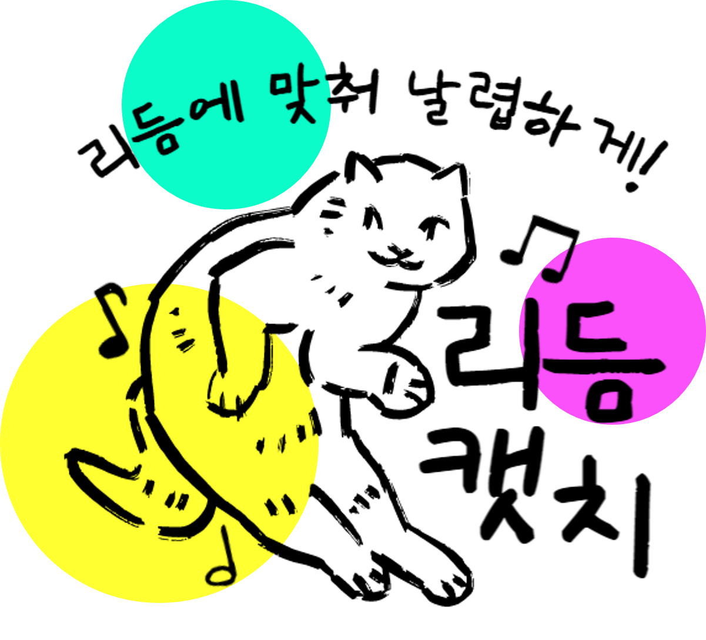

# 리듬캣치

Period: 2023.04 ~ 2023.05
<br>Skills: Embedded, Urreal
<br>About: 자체제작 임베디드 컨트롤러와 함께 즐기는 언리얼 엔진 기반 VR 리듬게임

## 👀 Overview

자체제작 컨트롤러와 함께 즐기는 언리얼 엔진 기반 VR 리듬게임, 리듬캣치입니다.

### 🐱 로고




### ✔️ Skill

- Embedded: 임베디드 제작기술을 활용한 게임 플레이 **전용 컨트롤러** 개발
- Unreal: 전용 컨트롤러로 플레이가 가능한 **언리얼 VR 게임** 제작

### ✔️ Background

- 이전 두 개의 프로젝트에서 습득한 **기술의 집약체**라는 프로젝트라는 의미를 가지면서,
팀원 각자의 고유 **기술 간의 풍부한 시너지**를 낼 수 있어야 한다고 생각했습니다.
- SSAFY 내 지원 가능한 **자원을 실속있게 활용**하면서 팀의 **기술력**을 폭발시킬 수 있는 솔루션으로,
**VR 기기**를 활용한 **게임 구현** 및 현실감 극대화를 위한 **전용 컨트롤러를 제작**하기로 결정하였습니다.
- 이미 활용 경험이 있는 유니티 대신 VR 관련 템플릿과 레퍼런스가 풍부한 **언리얼 엔진**을 채택하였으며,
VR과 리듬 게임의 맛을 잘 살릴 수 있도록 컨트롤러의 형태를 **장갑으로 제작**하게 됐습니다.

## 🗺️ 플레이 화면: 총 5개의 미니맵

실제 사용자가 VR기기를 착용했을 때 보게 되는 리듬캣치 플레이 화면입니다.

### MAIN


### MAIN - HOW TO


### BEACH MAP


### FOREST MAP


### FRUIT MAP


### BASEBALL MAP


### REMIX MAP


## 🎛️ 게임 컨트롤러: 스마트 글러브

리듬캣치를 더 신나게 플레이하도록 도와주는 전용 컨트롤러, 스마트 글러브를 소개합니다.

### 스마트 글러브


### 회로도


## 🦾 Details

임베디드와 게임 제작 기술의 접목, 어떻게 이뤄졌을까요?

| **임베디드 PART** |  |
| --- | --- |
| Flex 센서 | - 구부러짐의 정도에 따라 저항 값이 달라지는 센서 <br> - 얼마나 세게 눌렸는지를 측정할 때 활용 <br> - 두 센서를 통해 들어오는 아날로그 신호를 디지털 신호로 가공 (ADC칩) |
| IMU 센서 | - 손의 위치를 파악하기 위한 IMU센서 <br> - x, y, z 축의 가속도와 각속도 총 6축의 데이터를 수집 <br> - 데이터들을 활용하여 손의 위치를 파악 |
| 디바이스 드라이버 | - 센서들의 최적화된 제어가 필수 <br> - 필수적인 데이터만 가져올 수 있도록 디바이스 드라이버를 직접 개발 |
| 소켓 통신 | - 다양한 운영체제와 프로그래밍 언어 사이에서 동일한 인터페이스를 사용 <br> - 실시간 데이터 통신을 위함 |

| **게임 PART** |  |
| --- | --- |
| VR게임 제작 | - VR게임모드로 개발 진행 <br> - VR게임 사용자경험을 고려하여 VR에서 최적화된 게임 설계 및 기획 <br> - 활용도가 높은 오큘러스 퀘스트2 를 게임 기기로 선정 |
| TCP소켓 플러그인 제작 | - 플러그인: 일종의 라이브러리 <br> - C++ 구성이 되어있는 플러그인을 블루프린트로 전환하여 맵핑 |
| 컨트롤러 매핑 | - 신호정보에 따른 도구들을 맵핑하여,  임베디드 파트에서 보내는 통신에 따라 다양한 도구 변환 기능 추가 |
| 리듬 판정 | - 도구 및 속도에 따라 오브젝트 파괴 판정을 계산하여 다양한 리듬 게임 구성 |

## ✨ **프로젝트 성과**

- **삼성 청년 SW아카데미 자율 프로젝트 우수상 (전국 3위)**
- 삼성 청년 SW아카데미 자율 프로젝트 우수상 (광주지역 1위)

## 😎 Member & Role

지구 상 최고의 조합을 자랑하는 BJS 박자수호단을 소개합니다.

- 팀장 : 조유빈 (PM, 휨센서, 압력센서 테스트 및 데이터 전처리, 회로도 배치 및 하드웨어 제작)
- 팀원 : 고현영 (디바이스 드라이버 연구, 사용자 영역 코드 개발, 배선도 작성, 하드웨어 제작)
- 팀원 : 박상현 (소켓 통신용 C++ 서버 개발, 센서 데이터 기반 오브젝트 매칭 기능 개발)
- 팀원 : 백현웅 (숲맵, 오브젝트, 음악, 리듬 노트 작업, 신호에 따른 도구 변환, 판정 코드 작성)
- 팀원 : 유승규 (해변맵, 야구맵, 리믹스맵, 오브젝트, 음악, 리듬 노트, waypoint 블루프린트 작업)
- 팀원 : 용승민 (메인, 과일맵, 튜토리얼 화면, 오브젝트, 음악, 리듬 노트, MRC 카메라 작업)

## 🚕 Git Convention

### Git-Flow

- master: 제품으로 출시될 수 있는 브랜치
- develop: 다음 출시 버전을 개발하는 브랜치
- feature: 기능을 개발하는 브랜치 (ex: feature/IMU_jh)
- release: 이번 출시 버전을 준비하는 브랜치
- hotfix: 출시 버전에서 발생한 버그를 수정하는 브랜치

### Commit Message

- 보기 쉽고 사용이 간편하면서도 명확한 커밋 관리를 위해, 커밋 템플릿을 활용합니다.
- **제목**은 명확하고 짧게, **내용**엔 커밋 배경, 변경 내용 등 보다 자세한 내용을 작성해주세요.
- vi 에디터 환경에서 커밋 메세지를 작성한 뒤 `:wq!`로 마무리!

  ```
  git config --global commit.template <.gitmessage.txt 경로>
  git commit
  ```

## ⚙ Tools for Collaboration

- Git
- Plastic SCM
- Jira
- Notion
- Mattermost, KakaoTalk

## 💻 Development Environment

- Embedded
    - Linux OS ver. armv7l
    - Linux kernel ver. 6.1.21-v7+
- Unreal : 4.27.2v
- VR : Oculus Quest2
